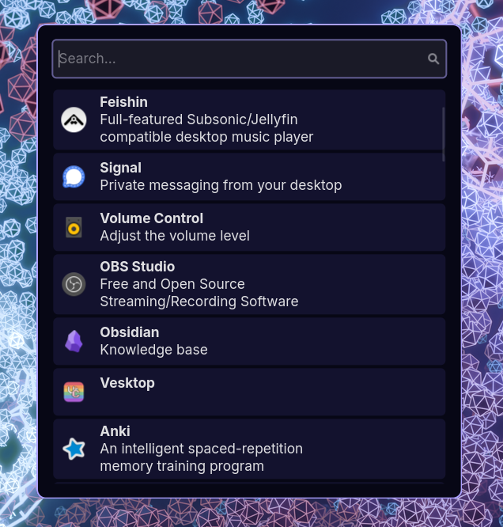
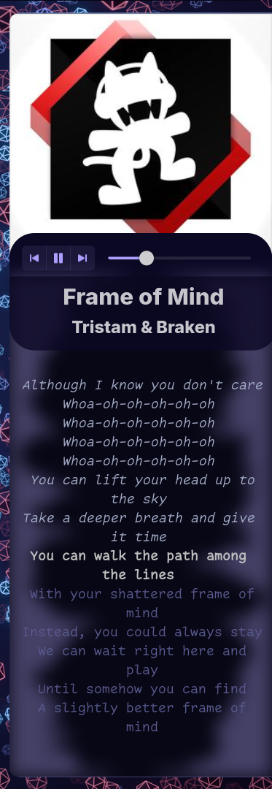
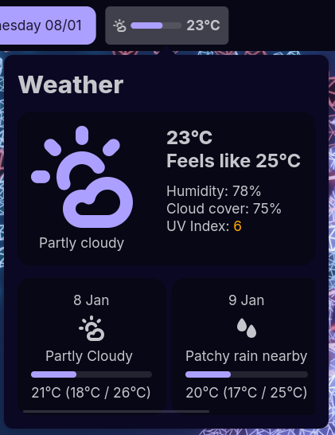

# Commashell

## A GUI Shell of all time

Commashell is a GTK + Libadwaita based shell for Linux powered by [Astal](https://aylur.github.io/astal/).
It is also a practical test bed for [Astal-rs](https://github.com/Suya1671/astal-rs)

NOTE: current designed with [commafiles](https://github.com/Suya1671/commafiles) in mind only.
I will add support for usage with other rices soon. Many things will look wrong if you try to use it with other rices right now.

## Features

- Top status bar (`astal toggle top`)
  - [x] Weather
  - [ ] Network status
  - [x] Time
  - [x] Wallpaper switcher
- Right music bar (`astal toggle right`)
  - [x] Music controls (Uses MPRIS)
  - [x] Lyrics (requires [sptlrx](https://github.com/raitonoberu/sptlrx) in mpris mode)
  - [x] Music visualizer (uses [CAVA](https://github.com/karlstav/cava))
- Notifications
  - Uses regular wayland protocols for notifications
- Launcher
  - [x] Fuzzy app launcher
  - [x] Calculator (requires [libqalculate](https://qalculate.github.io/). `= ` prefix)
  - [x] Journal entry (requires Obsidian + Thino Pro plugin. I will add support for other journaling apps soon:tm:. `; ` prefix)
  - [ ] Task taking (will use ticktick. I will add support for other task managers soon:tm:)

## Talk is cheap, show me the screenshots
oki

